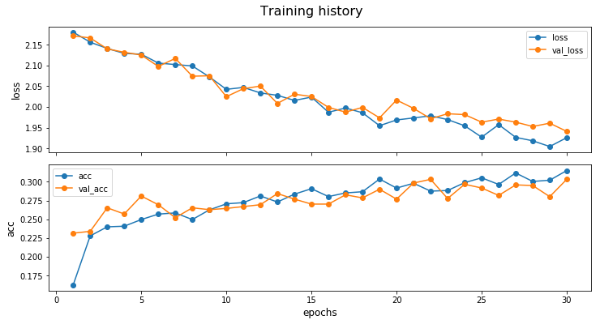

# KerasWrappers
Wrappers around the Sequential and Functional API of Keras  
by Alexander Braekevelt.

## Importing the wrappers
```python
from keras_wrappers import SequentialWrapper, ModelWrapper
```

## Creating a model
### Sequential API
```python
class MyModel(SequentialWrapper):
    def __init__(self):
        model = super().__init__(name='my_model')
	model.add(Dense(32, input_dim=784))
	model.add(Activation('softmax'))
	model.compile(optimizer='adam',
              loss='categorical_crossentropy',
              metrics=['accuracy'])

    def preprocess_x(self, data):
	# Optional preprocessing
        return super().preprocess_x(data)

    def preprocess_y(self, data):
	# Optional preprocessing
        return super().preprocess_y(data)

    def postprocess(self, data):
	# Optional postprocessing
        return super().postprocess(data)

my_model = MyModel()
```

### Functional API
```python
class MyModel(ModelWrapper):
    def __init__(self):
	a = Input(shape=(32,))
	b = Dense(32)(a)
        model = super().__init__(inputs=a, outputs=b, name='my_model')
	model.compile(optimizer='adam',
              loss='categorical_crossentropy',
              metrics=['accuracy'])

    def preprocess_x(self, data):
	# Optional preprocessing
        return super().preprocess_x(data)

    def preprocess_y(self, data):
	# Optional preprocessing
        return super().preprocess_y(data)

    def postprocess(self, data):
	# Optional postprocessing
        return super().postprocess(data)

my_model = MyModel()
```

## Training
Training saves epochs (if not interrupted) and applies both types of preprocessing.
```python
my_model.train(x, y)
```
```python
from keras.preprocessing.image import ImageDataGenerator
generator = ImageDataGenerator(
            width_shift_range=0.1,
            height_shift_range=0.1,
            ... ,
            horizontal_flip=True
          )
my_model.train_generator(generator, cat_train_x, cat_train_y, batch_size=64, epochs=5)
```

## Plotting
Plots loss and accuracy of all epochs combined.
```python
my_model.plot_history(logy=False)
```



## Predicting
Predicting applies preprocessing and postprocessing.
```python
prediction = my_model.predict_one(single_y)
predictions = my_model.predict_all(multiple_y)
```

## Saving
Saves both the model weights and the history.
```python
my_model.save_model()
```

## Loading
Restores the model weights and the history. (Requires same model architecture.)
```python
retrained_classifier.load_model('my_model_35_epochs')
```
